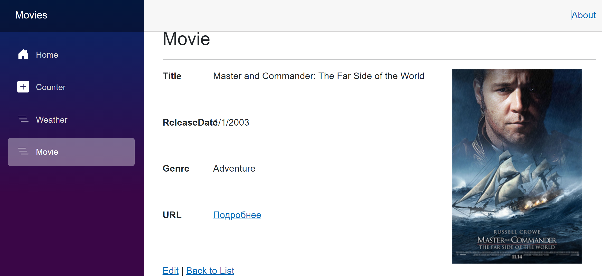

# Movies

Веб-приложение для управления коллекцией фильмов, разработанное на ASP.NET Core Blazor Server и Entity Framework Core.

## Screenshot



## Возможности

* Просмотр списка фильмов
* Добавление новых фильмов
* Редактирование информации о фильмах
* Удаление фильмов
* Хранение данных в Microsoft SQL Server
* Адаптивный интерфейс на Bootstrap

## Технологии

* ASP.NET Core 8
* Blazor Server
* Entity Framework Core
* SQL Server
* Bootstrap
* Razor Components

## Структура проекта

```text
Movies/
├── Components/
│   └── Pages/
├── Data/
│   └── MoviesContext.cs
├── Models/
│   └── Movie.cs
├── Migrations/
├── wwwroot/
├── appsettings.json
└── Program.cs
```

## Модель данных

Movie:

* Id
* Title
* ReleaseDate
* Genre
* Poster
* URL

## Локальный запуск

### Клонирование репозитория

```bash
git clone <repository-url>
cd Movies
```

### Настройка базы данных

Укажите строку подключения в `appsettings.Development.json`:

```json
{
  "ConnectionStrings": {
    "MoviesContext": "Server=(localdb)\\mssqllocaldb;Database=MoviesContext;Trusted_Connection=True;MultipleActiveResultSets=true"
  }
}
```

### Применение миграций

```powershell
Update-Database
```

### Запуск приложения

```bash
dotnet run
```

или через Visual Studio (F5).

## Публикация

Проект может быть опубликован на любом хостинге с поддержкой ASP.NET Core, например MonsterASP.NET.

Перед публикацией необходимо:

1. Создать базу данных SQL Server.
2. Настроить строку подключения.
3. Выполнить миграции Entity Framework Core.
4. Опубликовать приложение через Visual Studio Publish.

## Автор

Учебный проект для изучения Blazor Server, Entity Framework Core и SQL Server.
